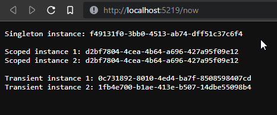

# DI (Dependency Injection)

Dependency Injection (DI) is a design pattern in which an object receives its dependencies from an external source rather than creating them itself. In .NET, dependency injection is a first-class citizen, and the framework provides built-in support for it.

In .NET, DI is supported natively and enables loose coupling, testability, and maintainable code.

## Why Use DI Instead of `new`

**Key Advantages of DI**

1. **Loose Coupling**
   * Directly using `new` tightly couples a class to specific implementations, making it harder to replace or extend dependencies.
   * DI allows you to depend on abstractions (interfaces), enabling easy replacement of implementations without modifying the dependent class.
2. **Improved Testability**
   * Classes that instantiate dependencies internally are harder to test because you can't easily mock or replace those dependencies.
   * DI lets you inject mocked implementations during testing, simplifying unit tests and enabling better isolation.
3. **Adherence to SOLID Principles**
   * **Single Responsibility Principle (SRP):** By removing dependency creation from the class, it only focuses on its primary responsibility.
   * **Dependency Inversion Principle (DIP):** DI ensures classes depend on abstractions rather than concrete implementations.
4. **Flexibility and Reusability**
   * DI enables switching implementations at runtime by reconfiguring the dependency container.
   * Classes become more reusable, as they don’t manage or depend on specific implementations.
5. **Lifecycle Management**
   * The DI container manages object lifecycles (transient, scoped, or singleton). Using `new` requires manual lifecycle management, which can lead to memory leaks or unintended behavior.
6. **Simplified Code and Scalability**
   * Centralized configuration of dependencies reduces boilerplate code.
   * As applications grow, DI scales well, handling complex dependencies and reducing errors.

---

### **Example**

**Without DI (using `new`):**

```csharp
public class OrderProcessor
{
    private readonly EmailService _emailService = new EmailService();

    public void ProcessOrder()
    {
        _emailService.SendEmail();
    }
}
```

* Tightly coupled to `EmailService`, hard to test or replace.

**With DI:**

```csharp
public class OrderProcessor
{
    private readonly INotificationService _notificationService;

    public OrderProcessor(INotificationService notificationService)
    {
        _notificationService = notificationService;
    }

    public void ProcessOrder()
    {
        _notificationService.Notify();
    }
}
```

* Loosely coupled to `INotificationService`, easily testable and flexible.


Dependency Injection promotes better software design by decoupling classes, enhancing testability, and simplifying lifecycle management. Avoiding `new` fosters flexibility, maintainability, and adherence to SOLID principles. It’s especially critical in modern, scalable applications where managing dependencies manually becomes impractical.


# Singleton vs Scoped vs Transient


