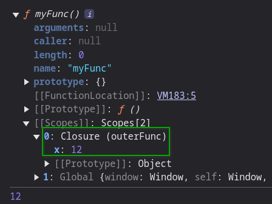

# Closures

Functions may need to access data outside of it's brackets.

```js
let x = 2;
function myFunction (){
	console.log(x);
}
```

Closure of a function is the function scope combined with the outside data that it accesses.

Here is an example code and it's console output:

```js
function outerFunc(){
	let x = 12;
    function myFunc(){
    	console.log(x);
    }
    console.dir(myFunc);
    myFunc();
}
outerFunc();
```

Output:


